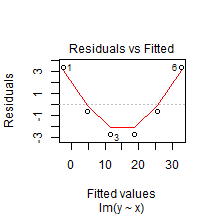
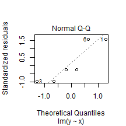
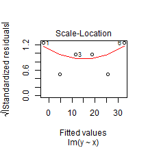
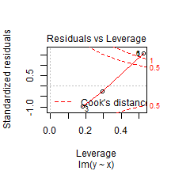

<center>
Topic for today
## Short Introduction to R Language
</center>
</br>
<div style="text-align:right;">
Viktor Dmitriyev </br>
Oldenburg, Germany </br>
21.01.2015
</div>

---
## What is R?

* Language for statistical computing tasks
* Free and open source software <b>environment</b>
* Different <b>"command-line interaction"</b> paradigm
* Widely supported
* Follws latest trends in industry and academia

---
## R is a simple programming paradigm
* Command-Line Interface
  * Pipe-based statistics (command-line statistisc)
* Almost no-programming background is required
* Language is similar to proprietery <b>S</b> and <b>S-plus</b>

---
## R is robust and widely supported
* Academia
  * Academia pushs lates updates as pacakges
  * Statistically heavy tasks
* Industry:
  * Idustry is very motivated in hiring R-spcialist
* Volunteers and enthusiasts 
  * contribues in community
  * Writing articles, blogs, answering questions

--- 
## Latest trends in R
* Up-to-date developers tools
* Ability to parallelize statistical workload
* Web based IDE version of RStudio


---
## Integration with other tools
* Can be easily integrated with other tools
* Unix-way of performing tasks
  * Open-source
  * Comman-Line based interaction
* Example of integration: <b>SAP HANA</b>
  * What is SAP HANA?
  * Where SAP HANA is moving now
  * How R language and SAP HANA integrates

---

```r
# R code example
x <- c(1,2,3,4,5,6)
y <- x^2
plot(lm(y ~ x))
```

    

---
</br>
## Thank you for your attention!
</br>
### This presentation was created with means of R language


---
## References

- [The R Project for Statistical Computing](http://www.r-project.org/)
- [RStudio - Powerful IDE for R](http://www.rstudio.com/)
- ["Introduction to R", Michael Clark](http://www3.nd.edu/~mclark19/learn/Introduction_to_R.pdf)
- ["An Introduction to R", Abecasis G.](http://www.sph.umich.edu/csg/abecasis/class/815.04.pdf)
- [R Markdown — Dynamic Documents for R](http://rmarkdown.rstudio.com/)
- [R (programming language) - Wikiw](http://en.wikipedia.org/wiki/R_%28programming_language%29)
